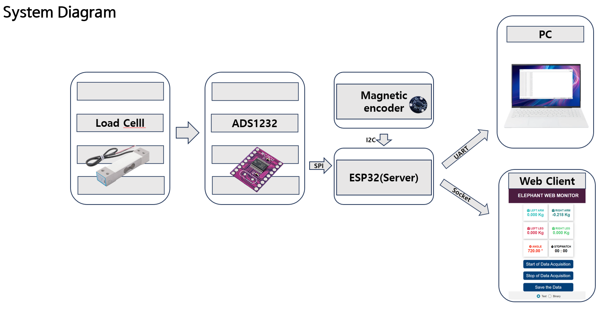
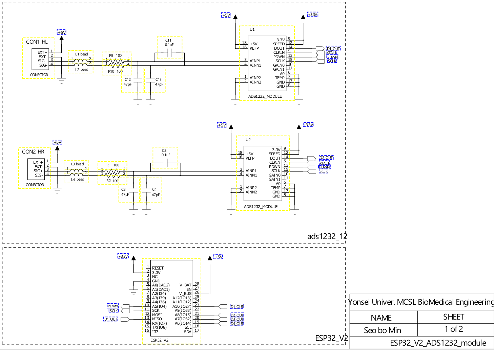
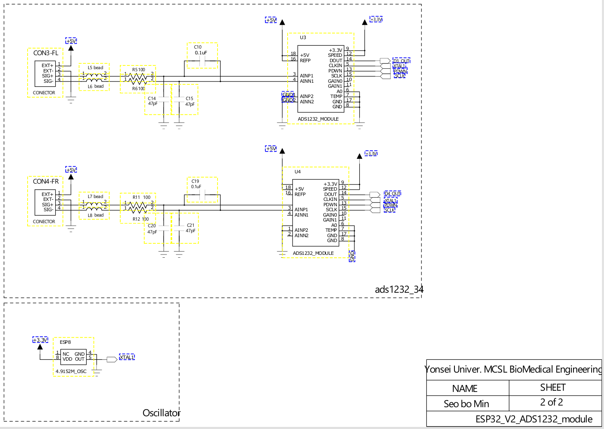
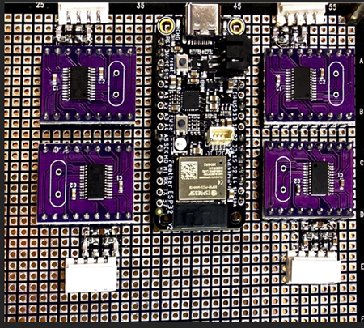
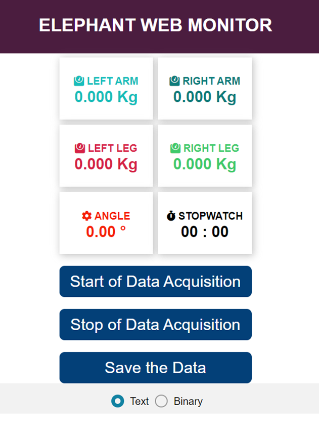

# 🚲 RehabilitationBicycle

> **재활 자전거 실시간 답력 측정 시스템**  
> ESP32 Feather V2 기반 4채널 로드셀 동기화 수집 + 웹 모니터링

<br>


---

## 📌 프로젝트 개요

재활 운동 자전거의 팔·다리 페달에 가해지는 힘을 **4채널 동시 수집**하고,  
브라우저 기반 웹 UI를 통해 실시간 모니터링 및 데이터 저장을 수행하는 임베디드 시스템입니다.

| 항목 | 내용 |
|------|------|
| MCU | Adafruit ESP32 Feather V2 (ESP32-PICO-Mini-02) |
| 개발 환경 | Arduino IDE |
| 샘플링 속도 | 40 SPS (80 SPS ÷ DataSubSamplePoint 2) |
| 최대 기록 시간 | 36분 (36×60×40 = 86,400 samples) |
| 메모리 사용 | 86,400 × 20 bytes = **1.65 MB** (PSRAM 2 MB 이내) |
| 통신 | Wi-Fi + WebSocket (`/ws`) |
| 파일 저장 | SPIFFS (웹 UI 호스팅 + 데이터 다운로드) |



---

## 🔧 하드웨어 구성

### 부품 목록

| 부품 | 모델 | 역할 |
|------|------|------|
| MCU | ESP32 Feather V2 | 메인 제어, Wi-Fi, PSRAM 2MB |
| ADC | ADS1232 × 4 | 24-bit 로드셀 신호 변환 |
| 각도 센서 | AS5600 | 크랭크 회전각 측정 (I2C) |
| 로드셀 | - | R.Arm / L.Arm / R.Leg / L.Leg 답력 측정 |
| LED | NeoPixel (GPIO 0) | 상태 표시 |
| 버튼 | GPIO 38 | 영점 보정 / Stand-alone 모드 진입 |

### 핀 맵

| 신호 | GPIO | 설명 |
|------|------|------|
| ADC DRDY/DOUT 1 | 27 | ADS1232 채널 1 (Right Arm) |
| ADC DRDY/DOUT 2 | 15 | ADS1232 채널 2 (Left Arm) |
| ADC DRDY/DOUT 3 | 32 | ADS1232 채널 3 (Right Leg) |
| ADC DRDY/DOUT 4 | 14 | ADS1232 채널 4 (Left Leg) |
| SCLK IN  | 25 | 인터럽트 기준 클럭 입력 |
| SCLK OUT | 5  | ADS1232 클럭 출력 |
| PDWN     | 4  | ADS1232 Power-down 제어 |

### 회로도




### 실제 하드웨어



---

## ⚙️ 핵심 구현

### 1. 4채널 동기화 샘플링 (인터럽트 기반)

SCLK 하강 엣지마다 ISR이 호출되어 4채널을 **동시에 1비트씩** 시프트 수집합니다.  
24클럭이 완료되는 순간 4채널 값이 동시에 확정되므로 채널 간 시간 오차가 없습니다.

```cpp
void IRAM_ATTR SPI_ISR() {
  idx++;
  uDATA1 = (uDATA1 << 1) + digitalRead(pin_ADC_DRDY_DOUT_1);
  uDATA2 = (uDATA2 << 1) + digitalRead(pin_ADC_DRDY_DOUT_2);
  uDATA3 = (uDATA3 << 1) + digitalRead(pin_ADC_DRDY_DOUT_3);
  uDATA4 = (uDATA4 << 1) + digitalRead(pin_ADC_DRDY_DOUT_4);

  if (idx >= 24) {
    DATA1_Raw = (long)(uDATA1 << 8) >> 8;  // 부호 확장
    ...
  }
}
```

### 2. 24-bit 2의 보수 부호 확장

ADS1232가 출력하는 24-bit raw 값을 ESP32의 32-bit `long`으로 올바르게 변환합니다.

```cpp
// ❌ 논리 시프트 → 부호 비트 손실
long value = (long)(uDATA >> 8);

// ✅ 산술 시프트 → MSB 부호 비트 전체 확장
long value = (long)(uDATA << 8) >> 8;
```

> `uDATA << 8`로 24-bit 값을 32-bit MSB 위치로 올린 뒤,  
> `>> 8` 산술 우시프트로 부호 비트를 상위 8비트 전체로 확장합니다.  
> ESP32는 `long` 산술 시프트를 보장합니다.

### 3. PSRAM 대용량 버퍼링

ESP32 Feather V2의 PSRAM(2 MB)을 활용해 수집 데이터를 RAM에 축적 후 일괄 전송합니다.  
실시간 Flash 쓰기를 피해 샘플링 지연 없이 40 SPS를 유지합니다.

```cpp
// 86,400 samples × 20 bytes = 1,728,000 bytes ≈ 1.65 MB
#define PACKET_SIZE  (36 * 60 * 40)

workingPointer = packetPointer =
    (struct sensors *)ps_calloc(PACKET_SIZE, sizeof(struct sensors));
```

### 4. EEPROM 레이아웃

캘리브레이션 값과 Wi-Fi 자격증명을 영구 저장합니다. (총 64 bytes)

| 주소 | 크기 | 내용 |
|------|------|------|
| 0 ~ 1   | 2 B  | AS5600 각도 오프셋 |
| 2 ~ 5   | 4 B  | 로드셀 1 오프셋 (Right Arm) |
| 6 ~ 9   | 4 B  | 로드셀 2 오프셋 (Left Arm) |
| 10 ~ 13 | 4 B  | 로드셀 3 오프셋 (Right Leg) |
| 14 ~ 17 | 4 B  | 로드셀 4 오프셋 (Left Leg) |
| 32 ~ 47 | 16 B | Wi-Fi SSID |
| 48 ~ 63 | 16 B | Wi-Fi Password |

---

## 📊 시스템 흐름

```
[로드셀 × 4]
     │
[ADS1232 × 4] ←── 공통 SCLK (GPIO 25 하강 엣지 인터럽트 동기화)
     │  24-bit × 4ch 동시 수집
[ESP32 Feather V2]
  ├─ PSRAM 버퍼링 (최대 36분 / 1.65 MB)
  ├─ AS5600 I2C 각도 읽기
  ├─ SPIFFS (index.html / script.js / style.css 호스팅)
  └─ WebSocket (/ws)
       ├─ JSON 실시간 전송 (2.5 Hz, 16 samples마다)
       └─ Binary 일괄 전송 (SAVE 명령, 5분 단위 청크)
```

---

## 🌐 웹 인터페이스

SPIFFS에 저장된 3개 파일로 구성되는 단일 페이지 모니터입니다.



| 파일 | 크기 | 역할 |
|------|------|------|
| `index.html` | ~2.3 KB | 센서 카드 UI, 제어 버튼 |
| `script.js`  | ~4.3 KB | WebSocket 처리, 이진 수신 및 파일 저장 |
| `style.css`  | ~1.5 KB | 레이아웃 및 색상 |
| **합계** | **~8.1 KB** | SPIFFS 기본 파티션(1.5 MB) 대비 0.5% 사용 |

**표시 항목:** Right Arm / Left Arm / Right Leg / Left Leg (kg) · Angle (°) · 스톱워치  
**저장 형식:** Text (공백 구분 정수) 또는 Binary 선택 가능

---

## 🚀 설치 및 실행

### 1. 라이브러리 설치 (Arduino IDE)

- `ESP32 Arduino` 보드 패키지 (Espressif)
- `ESPAsyncWebServer` + `AsyncTCP`
- `AS5600` (Rob Tillaart)
- `Adafruit NeoPixel`
- `Arduino_JSON`

### 2. 파티션 설정

`Tools > Partition Scheme > Default 4MB with spiffs (1.2MB APP / 1.5MB SPIFFS)`

> 웹 파일 3개 합계 ~8 KB이므로 기본 SPIFFS 파티션으로 충분합니다.

### 3. SPIFFS 파일 업로드

```
data/
├── index.html
├── script.js
└── style.css
```

`Tools > ESP32 Sketch Data Upload` 로 업로드

### 4. 최초 실행 시 SPIFFS 포맷

```cpp
#define FORMAT_SPIFFS_IF_FAILED  true   // 최초 1회만 true
// 이후 반드시 false로 되돌릴 것
#define FORMAT_SPIFFS_IF_FAILED  false
```

### 5. Wi-Fi 설정

첫 실행 시 시리얼 모니터(230400 bps)에서 주변 SSID 목록이 출력됩니다.  
번호 선택 후 비밀번호 입력 → EEPROM에 저장되어 이후 자동 접속됩니다.

> **GPIO 38 버튼을 누른 채 부팅**하면 Stand-alone 모드로 진입합니다.  
> 네트워크 없이 시리얼 출력만 동작하며 PSRAM 기록은 비활성화됩니다.

### 6. 영점 보정 (캘리브레이션)

무부하 상태에서 **버튼을 길게 누릅니다.**  
현재 로드셀 raw 값과 AS5600 각도가 EEPROM 오프셋으로 저장됩니다.

---

## 📁 레포지토리 구조

```
RehabilitationBicycle/
└── RehabilitationBicycle.ino   # 메인 펌웨어
data/                           # SPIFFS 업로드 대상
├── index.html
├── script.js
└── style.css
docs/                           # README 이미지 (SPIFFS 업로드 제외)
├── system_diagram.png
├── hardware.jpg
├── schematic_12.png
├── schematic_34.png
└── webui.png
README.md
```

---

## 👤 개발자

| | |
|---|---|
| **이름** | 서보민 (Bromine) |
| **GitHub** | [@bromine1997](https://github.com/bromine1997) |
| **포트폴리오** | [bromine1997.github.io/web-porfolio](https://bromine1997.github.io/web-porfolio) |

